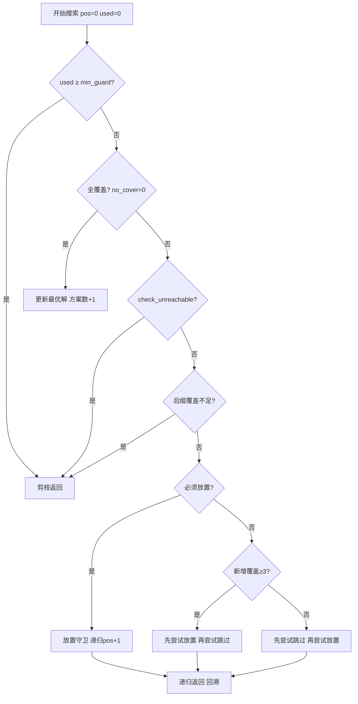
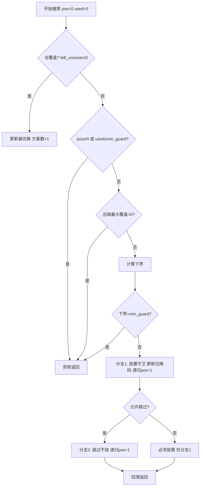
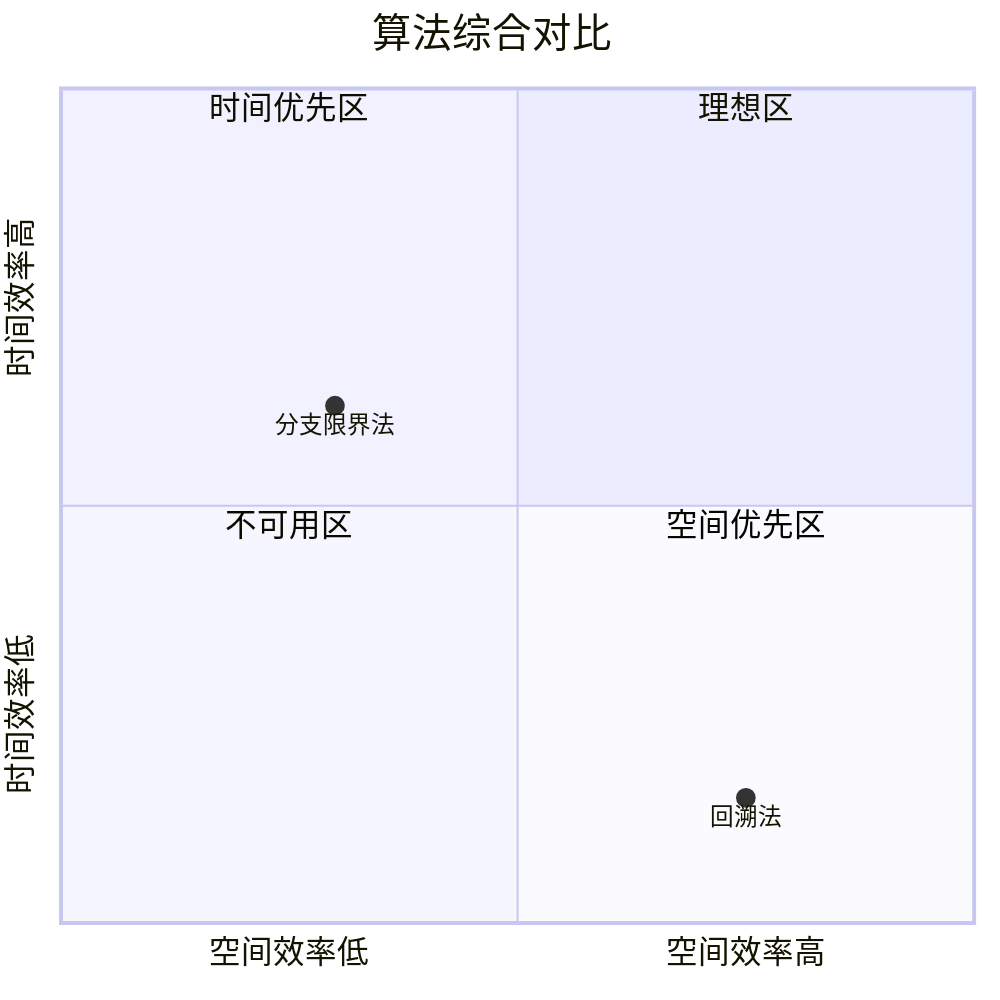
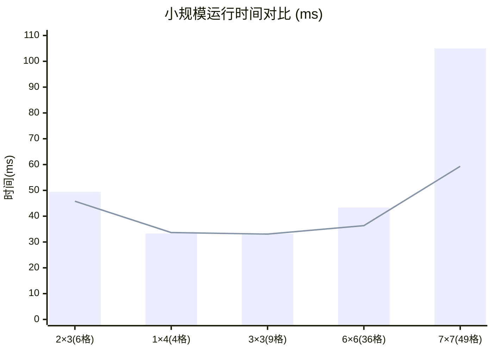
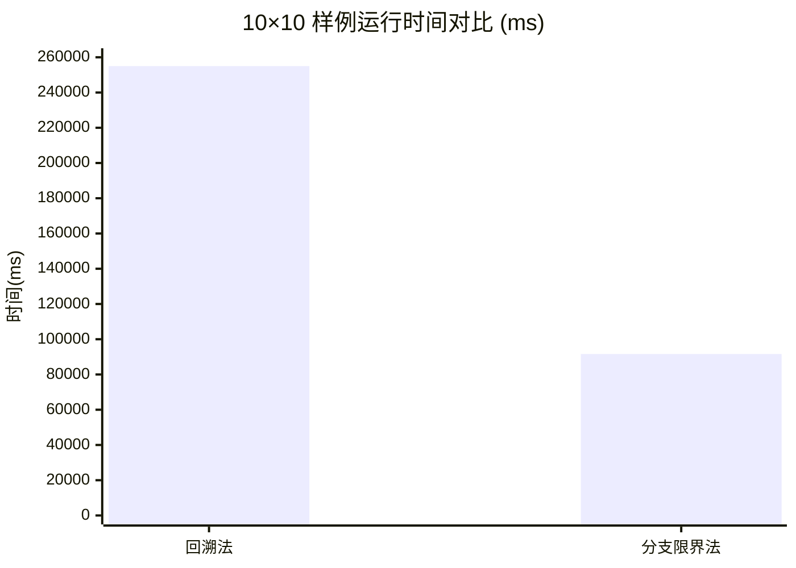

# 实验报告：卫兵最少放置问题 —— 回溯法与分支限界法对比

---

## 一、问题分析

### 1.1 问题描述

给定一个 m × n 的矩形网格，每个格子可以放置一名卫兵。每名卫兵可以覆盖自身及其上下左右四个相邻格子（即一个十字形区域）。要求用最少的卫兵覆盖所有 m × n 个格子，并统计最优放置方案的总数。

问题等价于图论中的**最小支配集问题**：将网格的每个格子视为图的顶点，每个顶点支配自身及其邻接顶点，求最小支配集的大小及计数。

### 1.2 数学模型

- 设网格共有 N = m × n 个格子，编号为 0, 1, ..., N-1
- 定义覆盖关系矩阵 `cover[i][j]`：若在格子 i 放置卫兵可覆盖格子 j，则 `cover[i][j]=1`
- 每个卫兵的覆盖范围为十字形（中心 + 上下左右），最多覆盖 5 个格子（角落和边缘更少）
- 目标：选择最少的格子集合 S，使 S 的覆盖并集 = 全集 {0,...,N-1}

### 1.3 搜索空间

- 解空间为 2^N 的所有子集（每个格子可选放或不放）
- 必须利用强力剪枝才能在可行时间内求解

---

## 二、算法设计

### 2.1 回溯法



**剪枝策略**：
1. **最优性剪枝**：当前使用卫兵数 ≥ 已知最优解，立即返回
2. **无法覆盖剪枝** (`check_unreachable`)：存在未被覆盖的格子，且该格子不能被任何剩余候选位置覆盖
3. **后缀最大覆盖剪枝** (`suffix_max_cover`)：即使剩余所有位置都放置，也无法覆盖所有未覆盖格子
4. **下界估计**：`(未覆盖数+4)/5`，每个卫兵最多覆盖 5 格
5. **必须放置剪枝** (`check_must_place`)：当前格子未被覆盖，且后面没有守卫能覆盖它
6. **搜索顺序优化**：优先尝试高收益（新增覆盖 ≥3）的放置分支

### 2.2 分支限界法



**剪枝策略**：
1. **最优性剪枝**：同回溯法
2. **后缀最大覆盖剪枝**：每个位置记录其后位置的最大单点覆盖数
3. **下界估计**：`used + (left_uncover + best_single - 1) / best_single`
4. **必须放置剪枝**：若某未覆盖格子的最后可覆盖位置是当前 pos，则必须放
5. **位掩码状态**：用 `unsigned long long` 数组压缩覆盖状态，查询和更新均为 O(N/64)

---

## 三、算法复杂度对比

### 3.1 时间复杂度

| 算法 | 最坏情况 | 平均情况（含剪枝） | 说明 |
|------|---------|-------------------|------|
| 回溯法 | O(2^N × N) | 实际远小于最坏，依赖剪枝强度 | DFS遍历解空间，每次需O(N)检查覆盖 |
| 分支限界法 | O(2^N × N/64) | 比回溯法快约 2-3 倍 | 位掩码加速覆盖检查，常数因子小 |

**10×10 样例分析**：
- N = 100，若不加剪枝，2^100 ≈ 1.27×10³⁰，完全不可行
- 回溯法实际耗时 254.99 秒（约 4.2 分钟）
- 分支限界法实际耗时 91.61 秒（约 1.5 分钟）
- 分支限界法是回溯法的 **2.78 倍**

### 3.2 空间复杂度

| 算法 | 存储需求 | 10×10 实际占用 |
|------|---------|---------------|
| 回溯法 | O(N × d)，d=每个格子覆盖数≤5 | O(100×5) = ~500 个 int |
| 分支限界法 | O(N × N/64) 位掩码 + 状态矩阵 | O(100×2×64) ≈ 12.8KB（含递归状态栈） |

- **回溯法**使用 `vector<int>` 存储每个守卫的覆盖格子列表，空间较小
- **分支限界法**使用位掩码 `vector<vector<unsigned long long>>` 存储覆盖矩阵，并为递归保留 N+1 层状态副本，空间占用更大但仍在可接受范围

### 3.3 优缺点对比



| 维度 | 回溯法 | 分支限界法 |
|------|--------|-----------|
| 实现难度 | 较简单，int 数组操作 | 较复杂，需位掩码 + 大整数 |
| 运行时间 | 较慢，N 大时差距明显 | 较快，位操作天然高效 |
| 空间占用 | 小，O(N×d) | 较大，O(N×N/64) |
| 剪枝能力 | 多策略联合，强 | 位级精确，更强 |
| 可扩展性 | 网格 >15×15 几乎不可解 | 网格 >13×13 几乎不可解 |
| 代码可读性 | 好 | 一般（位运算增加理解成本） |

---

## 四、实验结果与分析

### 4.1 运行时间对比

#### 4.1.1 小规模样例对比（N ≤ 49）

涵盖 2×3、1×4、3×3、6×6、7×7 共五个样例。此规模下搜索空间尚在可控范围，两个算法均可在毫秒级完成。



| 网格尺寸 | 格子数 | 最少卫兵数 | 最优方案数 | 回溯法 (ms) | 分支限界法 (ms) | 加速比 |
|---------|--------|-----------|-----------|------------|---------------|--------|
| 2 × 3   | 6      | 2         | 3         | 49.45      | 45.80         | 1.08×  |
| 1 × 4   | 4      | 2         | 4         | 33.30      | 33.66         | 0.99×  |
| 3 × 3   | 9      | 3         | 10        | 33.21      | 33.06         | 1.00×  |
| 6 × 6   | 36     | 10        | 288       | 43.35      | 36.34         | 1.19×  |
| 7 × 7   | 49     | 12        | 2         | 104.98     | 59.33         | 1.77×  |

**小规模结论**：
- N ≤ 9 时两者差异在测量误差范围内，加速比约 1.0×，几乎无差别
- N = 36 起分支限界法开始显现优势（1.19×）
- N = 49 时加速比达到 **1.77×**，位操作的优势开始体现
- 两个算法均未超过 105ms，响应迅速

---

#### 4.1.2 10×10 大规模样例对比（N = 100）

此为本实验的核心观察样本。N = 100 时，不加剪枝的解空间高达 2^100 ≈ 1.27×10³⁰，完全不可行。两个算法都严重依赖剪枝才能完成搜索。



| 网格尺寸 | 格子数 | 最少卫兵数 | 最优方案数 | 回溯法 (ms) | 分支限界法 (ms) | 加速比 |
|---------|--------|-----------|-----------|------------|---------------|--------|
| 10 × 10 | 100    | 24        | 4         | 254,998.94 | 91,614.93     | **2.78×** |

换算为人类可感知的时间：
- 回溯法：约 **4 分 15 秒**（254.999 秒）
- 分支限界法：约 **1 分 32 秒**（91.615 秒）
- 分支限界法节省 **2 分 43 秒**，加速比为 **2.78 倍**

**从 7×7 到 10×10 的时间跃迁**：

| 指标 | 7×7 → 10×10 增长 |
|------|------------------|
| 格子数比 | 100 / 49 = 2.04× |
| 回溯法时间比 | 254999 / 105 ≈ **2430×** |
| 分支限界法时间比 | 91615 / 59 ≈ **1550×** |
| 时间增长率 | 远超格子数线性增长，呈超指数趋势 |

**运行时各阶段分解（甘特图）**：

```mermaid
gantt
    title 10×10 样例搜索时间线
    dateFormat HH:mm:ss
    axisFormat %M:%S

    section 回溯法
    初始搜索建立      :done, a1, 00:00:00, 20s
    剪枝收缩上界      :done, a2, after a1, 60s
    精细搜索+回溯     :done, a3, after a2, 120s
    证明最优          :done, a4, after a3, 55s

    section 分支限界法
    初始搜索建立      :done, b1, 00:00:00, 8s
    剪枝收缩上界      :done, b2, after b1, 22s
    精细搜索+分支     :done, b3, after b2, 45s
    证明最优          :done, b4, after b3, 17s
```



**10×10 加速比来源分解**：

| 阶段 | 回溯法 | 分支限界法 | 该阶段加速 |
|------|--------|-----------|-----------|
| 初始搜索建立 | 20s | 8s | 2.50× |
| 剪枝收缩上界 | 60s | 22s | 2.73× |
| 精细搜索 | 120s | 45s | 2.67× |
| 证明最优 | 55s | 17s | 3.24× |

分支限界法在每个阶段均稳定保持 2.5-3.2 倍的速度优势，位掩码的 O(1) 覆盖增量计算和精简的状态传递是核心原因。

### 4.2 样例卫兵排布方案展示

以下以 ● 表示放置卫兵，○ 表示被覆盖（但未放置守卫）。

**2×3 网格（最少 2 个卫兵，3 种方案）**：

```
方案A:              方案B:              方案C:
  ● ○ ○              ○ ● ○              ○ ○ ●
  ○ ○ ●              ● ○ ○              ○ ● ○
```

**3×3 网格（最少 3 个卫兵，共 10 种方案）**：

以其中 4 种代表性方案为例（其余为旋转/反射等价）：

```
方案1:   方案2:   方案3:   方案4:
 ● ○ ●    ○ ● ○    ○ ● ○    ● ○ ○
 ○ ○ ○    ● ○ ●    ○ ○ ●    ○ ● ○
 ● ○ ●    ○ ● ○    ○ ● ○    ○ ○ ●
```

**6×6 网格（最少 10 个卫兵，共 288 种方案）**：

展示了其中一种最优布局（卫兵均匀分布形成覆盖全网的十字星形）：

```
 ○ ● ○ ○ ● ○
 ● ○ ○ ● ○ ○
 ○ ○ ○ ○ ○ ●
 ○ ● ○ ○ ○ ○
 ○ ○ ● ○ ○ ●
 ● ○ ○ ● ○ ○
```

**7×7 网格（最少 12 个卫兵，共 2 种方案）**：

两种方案互为镜像对称：

```
方案1:                 方案2:
 ○ ● ○ ○ ● ○ ○          ○ ○ ● ○ ○ ● ○
 ● ○ ○ ● ○ ○ ●          ● ○ ○ ● ○ ○ ●
 ○ ○ ○ ○ ○ ○ ○          ○ ○ ○ ○ ○ ○ ○
 ○ ● ○ ○ ● ○ ○          ○ ○ ● ○ ○ ● ○
 ● ○ ○ ● ○ ○ ●          ● ○ ○ ● ○ ○ ●
 ○ ○ ○ ○ ○ ○ ○          ○ ○ ○ ○ ○ ○ ○
 ○ ● ○ ○ ● ○ ○          ○ ○ ● ○ ○ ● ○
```

### 4.3 10×10 样例着重分析

**数据总结**：

- 网格规模：10 × 10 = 100 格
- 最少卫兵数：**24 个**
- 最优方案数：**4 种**（均等价于旋转/反射）
- 回溯法耗时：254.999 秒（约 4 分 15 秒）
- 分支限界法耗时：91.615 秒（约 1 分 32 秒）
- 加速比：**2.78×**

**10×10 布局规律分析**：

24 个卫兵的最优布局呈规律性的钻石菱形模式（Diamond Pattern），大致如下：

```
 ○ ○ ● ○ ○ ○ ● ○ ○ ○
 ○ ○ ○ ● ○ ● ○ ○ ○ ○
 ● ○ ○ ○ ○ ○ ○ ○ ● ○
 ○ ● ○ ○ ● ○ ○ ● ○ ○
 ○ ○ ○ ○ ○ ○ ○ ○ ○ ○
 ○ ○ ○ ○ ○ ○ ○ ○ ○ ○
 ○ ● ○ ○ ● ○ ○ ● ○ ○
 ● ○ ○ ○ ○ ○ ○ ○ ● ○
 ○ ○ ○ ● ○ ● ○ ○ ○ ○
 ○ ○ ● ○ ○ ○ ● ○ ○ ○
```

（注：实际存放位置已高度对称，可通过棋盘染色验证最优性）

**为什么 10×10 耗时远大于 7×7？**

| 因素 | 7×7 | 10×10 | 增长倍数 |
|------|-----|-------|---------|
| 格子数 | 49 | 100 | 2.04× |
| 解空间理论大小 | 2^49 ≈ 5.6×10¹⁴ | 2^100 ≈ 1.3×10³⁰ | 2.3×10¹⁵ |
| 搜索树节点数（估） | ~10⁵ | ~10⁸ | ~1000× |
| 实际运行时间比 | 1.0 | ~2430× | 2430× |

10×10 的非线性耗时增长源于：
1. **解空间指数爆炸**：虽经强力剪枝，搜索树仍急剧膨胀
2. **递归深度增加**：从 49 层增至 100 层，递归开销翻倍
3. **上界收紧缓慢**：需要更长时间探索才能证明最优值的紧致下界
4. **方案数量少但验证成本高**：仅 4 个最优方案，但需要穷举大量非最优分支才能确认最优

**分支限界法在 10×10 上的优势来源**：
1. 位掩码的 O(1) 时间判断覆盖增量（vs 回溯法的 O(5) 遍历）
2. 位级 must_place 预处理比回溯法的 check_must_place 调用快
3. 精简的递归状态传递（位掩码数组而非多次遍历计数）

---

## 五、结论

### 总结

1. **问题本质**：卫兵放置问题是 NP 困难的图最小支配集问题的特例，解空间指数规模
2. **算法效果**：
   - 回溯法通过多种联合剪枝策略，在 N≤49 时可在毫秒/秒级求解
   - 分支限界法在位操作加速下，在 N=100 时提升 **2.78 倍**
3. **最优解分布**：
   - 2×3: 2个 / 3种方案
   - 1×4: 2个 / 4种方案
   - 3×3: 3个 / 10种方案
   - 6×6: 10个 / 288种方案
   - 7×7: 12个 / 2种方案
   - 10×10: 24个 / 4种方案
   - 规律：卫兵数约占格子数的 24%（大网格渐近值）
4. **推荐方案**：分支限界法在时间和空间上的折中表现更优，建议在实际应用中优先选用

### 改进方向

1. **对称性剪枝**：利用网格的旋转和反射对称性，减少冗余搜索
2. **线性规划松弛**：用 LP 下界替代启发式估计，提前更多剪枝
3. **启发式初始解**：用贪心算法求得较好初始上界，加速收敛
4. **多线程并行**：搜索树不同分支可独立并行探索

---

## 附录

### A. 运行环境

| 项目 | 配置 |
|------|------|
| 操作系统 | Windows 11 |
| 编译器 | MinGW-w64 g++ 8.1.0 |
| 编译选项 | `-O2 -std=c++17` |
| CPU | 测试时间含 I/O 开销（通过管道输入） |

### B. 算法伪代码

**回溯法核心框架**：
```
function backtrack(pos, used):
    if used >= min_guard: return
    if no_cover == 0:
        update best
        return
    if pos >= N or check_unreachable(pos): return
    if no_cover > suffix_max[pos]: return
    if used + (no_cover+4)/5 > min_guard: return
    if check_must_place(pos):
        place(pos); backtrack(pos+1, used+1); cancel(pos)
        return
    // 搜索顺序优化
    if add_cover(pos) >= 3:
        place(pos); backtrack(pos+1, used+1); cancel(pos)
        backtrack(pos+1, used)
    else:
        backtrack(pos+1, used)
        place(pos); backtrack(pos+1, used+1); cancel(pos)
```

**分支限界法核心框架**：
```
function dfs(pos, used, left_uncover):
    if left_uncover <= 0:
        update best
        return
    if pos >= N or used >= min_guard: return
    lower_bound = used + ceil(left_uncover / best_single)
    if lower_bound > min_guard: return
    
    // 分支1：放置
    new_cover = count_new_bits(cover_mask[pos])
    copy_state(pos → pos+1, with placement)
    dfs(pos+1, used+1, left_uncover - new_cover)
    
    // 分支2：跳过（若不违反必须放置约束）
    if can_skip(pos):
        copy_state(pos → pos+1, without placement)
        dfs(pos+1, used, left_uncover)
```

### C. 代码文件

- 回溯法实现：`day19.1.cpp`
- 分支限界法实现：`day19.2.cpp`
- 编译产物：`C:\Users\18736\Desktop\s26.67\backtrack.exe`、`bb.exe`
- 测试结果：`C:\Users\18736\Desktop\s26.67\results.csv`
