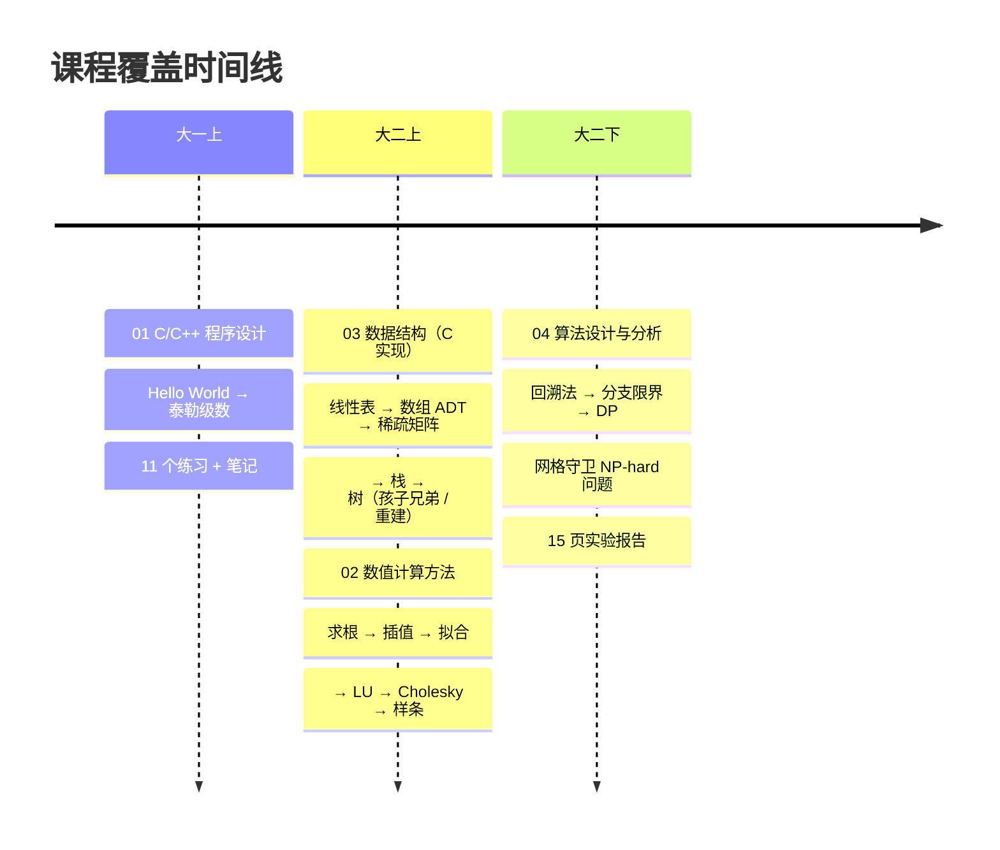

# 算法练习仓库

江南大学 计科 2404 · 钞方贺（1030424416）  
**按「课程 → 时间」整理**，全部中文命名，55 个代码文件覆盖 5 门核心课。

---

## 这个仓库展示的能力

| 能力 | 体现在 |
|------|--------|
| **C/C++ 编程** | 01 模块 11 个渐进练习，从 Hello World 到泰勒级数 |
| **数值算法实现** | 02 模块 16 个算法，涵盖高斯消元、LU 分解、样条插值等 |
| **数据结构（C 语言）** | 03 模块 9 个 ADT 实现：顺序表、多维数组、稀疏矩阵、栈、树 |
| **算法设计与分析** | 04 模块 4 种回溯 + 3 种 DP 方案，解决 NP-hard 问题 |
| **算法对比与学术写作** | 04 模块含 15 页实验报告（Mermaid 图表 + 甘特图 + 复杂度分析） |
| **工程化习惯** | 每个目录有 README 索引，文件统一编号，Git 规范提交 |

---

## 目录总览

| 目录 | 课程 | 学期 | 文件 | 核心内容 |
|------|------|------|------|---------|
| [`01-C++程序设计基础`](./01-C++程序设计基础/) | C/C++ 程序设计 | 大一上 | 11 + 笔记 | 语法、STL、stringstream、级数 |
| [`02-数值计算方法`](./02-数值计算方法/) | 数值计算方法 | 大二 | 16 | 方程求根、高斯消元、插值拟合、样条 |
| [`03-数据结构`](./03-数据结构/) | 数据结构 | 大二上 | 9 | 顺序表、数组 ADT、稀疏矩阵、栈、树 |
| [`04-网格守卫问题`](./04-网格守卫问题/) | 算法设计与分析 | 大二下 | 8 + 报告 | 回溯 / 分支限界 / DP 解 NP-hard 最小支配集 |
| [`05-贪心与算法专项`](./05-贪心与算法专项/) | 算法专项练习 | 贯穿 | 5 | 贪心、数论、DP 入门 |

---

## 学期时间线



---

## 亮点项目

### 网格守卫最少放置（04-网格守卫问题）

NP-困难的图最小支配集问题，完整实现算法演进：

| 版本 | 方法 | 剪枝策略 | 10×10 耗时 | 加速比 |
|------|------|---------|-----------|--------|
| 01 | 回溯 · 基础 | 最优性剪枝 | ❌ 超时 | — |
| 02 | 回溯 · 行剪枝 | + 行级覆盖 | — | — |
| 03 | 回溯 · 优化 | + mustPlace + 后缀 | — | — |
| 04 | 回溯 · 全剪枝 | 6 种联合策略 | 255s | 基准 |
| 05 | 分支限界 · 位掩码 | 位操作 O(N/64) | 91s | **2.78×** |

含完整实验报告（Mermaid 流程图、甘特图、方案可视化、复杂度对比）。

### 数值计算工具集（02-数值计算方法）

`11-数值计算工具集.cpp` 包含 **18 种数值方法**：泰勒级数、二分法、不动点迭代、牛顿法、高斯消元、LU 分解、Cholesky 分解、Jacobi 迭代、Gauss-Seidel、追赶法、矩阵求逆、多项式插值、拉格朗日插值、三次样条、最小二乘法、艾特肯加速等。

---

## 快速开始

```bash
# 编译运行任意 C++ 文件
g++ -O2 -std=c++17 01-C++程序设计基础/01-基础输入输出.cpp -o hello && ./hello

# 编译运行 C 语言数据结构
gcc 03-数据结构/01-顺序表-静态数组实现.c -o sqlist && ./sqlist

# 批量编译数值计算方法
cd 02-数值计算方法
for f in *.cpp; do g++ -O2 "$f" -o "${f%.cpp}.exe"; done
```

## 技术栈

- C（C99）· C++（C++17）
- 编译器：MinGW-w64 g++ 8.1+
- 平台：Windows 11

## 作者

**钞方贺**（1030424416）  
江南大学 · 人工智能与计算机学院 · 计算机科学与技术 2404
